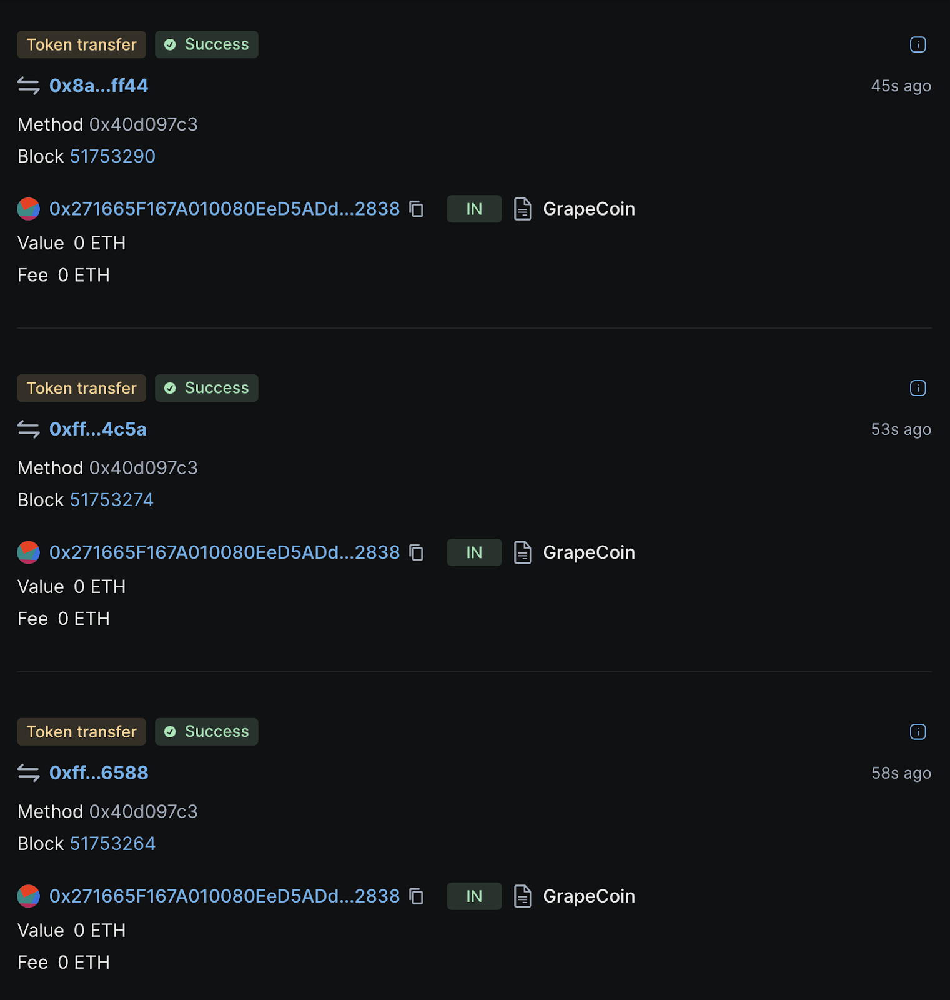

Gas fees are a significant hurdle for user onboarding. It is confusing to explain to newcomers why they need to buy ETH or TRX to use USDT, why transaction fees fluctuate, and why fees might exceed the transaction value.

LightLink's Enterprise Mode offers a solution for dApps and enterprises to provide their users with gasless transactions (zero fees), thereby simplifying onboarding.

dApps and enterprises pay a fixed price in stablecoins for a set amount of gas units and register smart contracts to utilize that gas. Their users send transactions with the gasPrice parameter set to 0, enabling on-chain operations without needing any tokens in their balances.

### Benefits of Enterprise Mode

Enterprises: Predictable, fixed-fee gas subsidy subscription

Pay a fixed fee for up to 50,000 daily transactions, avoiding the volatility of demand-driven fees

dApps: Access to a vast enterprise ecosystem

Tap into an ecosystem of potentially millions of users from LightLink's enterprise partners

Users: High-throughput transactions without fees

Enjoy seamless, gasless interactions with dApps, without requiring any tokens
