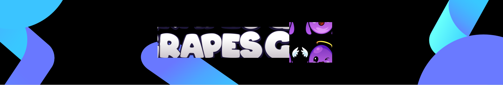
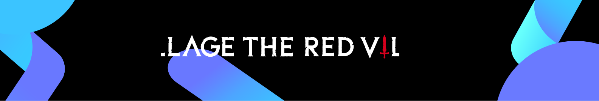
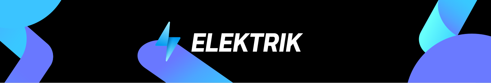
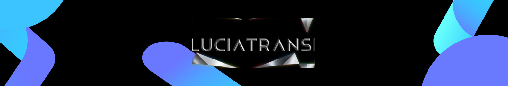
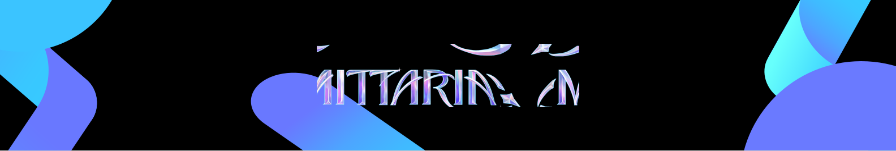

Below are examples of what you can use and build on LightLink. All the products mentioned have been proudly built and deployed on LightLink.

## Play-to-Earn: Grapes

Play-to-Earn projects particularly benefit from Enterprise Mode, as it allows new users to earn in-game tokens and spend them without being aware of the underlying cryptography and decentralized computations.

[Grapes](https://www.joingrapes.com/grapecoin) features a collection of mobile games centered around grapes and NFTs. It is launching GrapeCoin, a fungible token on LightLink, offering users gasless transactions for various activities.

Grapes attracted [150,000 followers on X (Twitter)](https://twitter.com/joingrapes), thousands of unique holders, and a weekly trading [volume of 2000+ ETH](https://blur.io/collection/the-grapes).

## Web3 Games: The Red Village

For Web3 games, gasless fees can attract more gamers, as they allow claiming in-game NFT items for free and starting their journey without the typical high-cost barriers of Web3 games.

[The Red Village](https://theredvillage.com/), a dark fantasy metaverse game with team-based combat mechanics, migrated to LightLink to reduce transaction fees, enhance the user experience with improved throughput, and simplify onboarding through gasless transactions.

The Red Village is preparing to release the Darklands while maintaining over [1000 unique weekly users](https://dappradar.com/dapp/the-red-village?range-ds=30d&range-ha=1y) and facilitating [thousands of battles](https://theredvillage.com/leaderboards).

## DEX: Elektrik

Enterprise Mode can be used for user engagement, such as offering free transactions for a limited time, for a promoted pool, or as a reward in a trading competition.

[Elektrik](https://elektrik.network/) is a decentralized exchange that utilizes Enterprise Mode to enable its users to swap tokens without any fees.

Elektrik has developed a unique AI-driven dynamic [liquidity provision mechanism](https://medium.com/@ElektrikNetwork/dynamic-liquidity-provision-ai-powered-capital-efficiency-d777282cfb44) that leverages Enterprise Mode to constantly and robustly manage liquidity with on-chain transactions. Gasless fees allow for the dynamic shifting of liquidity to where it is needed most and help reduce slippage.

## Metaverse: Translucia

Metaverses built on new blockchains often face challenges in convincing users to install proprietary wallets and buy native gas tokens. With EVM-equivalent LightLink, most popular wallets are already compatible, and with the multiverse concept, the user base of metaverses is poised to expand faster than ever.

[Translucia](https://www.translucia.com/) is a Multiverse Convergence solution that aims to accelerate the entry of traditional businesses into Web3 by uniting third-party metaverses. Essentially, it is an infrastructure project that connects metaverses into a multiverse, offering players an endless world to explore.

T&B Media Global, an entertainment company within the family business of CP Group, which owns 7-Eleven, Family Mart, Lotus, Makro, and True, has supported Translucia with a significant [investment of $300 million](https://www.tandbmediaglobal.com/post/t-b-launches-translucia-metaverse-a-major-virtual-world-project-and-partnered-with-mqdc). This funding will be primarily allocated to building core infrastructure and developing content for the Metaverse platform.

## Metaverse: Mittaria

For experience-based projects, LightLink’s gasless fees are crucial, as artists are rarely interested in calculating gas costs and spending money on publishing their work.

[Mittaria](https://mittaria.io/) is a Web3 metaverse for creators to connect, co-own, and co-create in fields such as animation, music, movies, and fashion. Mittaria is also backed by T&B Media Global.
